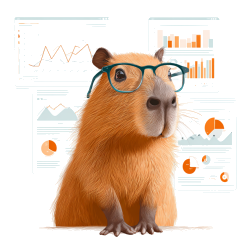

# BioTools



**BioTools** is a collection of web-based tools for analyzing biodiversity data from [Laji.fi](https://laji.fi), Finland's biodiversity data portal. It demonstrates an app gallery concept where users can access various data analysis tools through a unified interface.

- **Data Fetching**: Automated data retrieval from Laji.fi API
- **Interactive Tools**: Web-based analysis tools for biodiversity data
- **Local Development**: Easy setup for local testing and development
- **Friendly and Smart Capybara**: Because a capybara staring at you makes you happy.

## Setup

### First time setup

```bash
python3.10 -m venv venv
source venv/bin/activate
pip install -r requirements.txt
```

## Daily Usage

```bash
source venv/bin/activate
python app.py
```
Access the app at http://localhost:5000/simple

```bash
deactivate
```

## Package Management

```bash
pip install package_name
pip freeze > requirements.txt
```

```bash
pip install -r requirements.txt
```